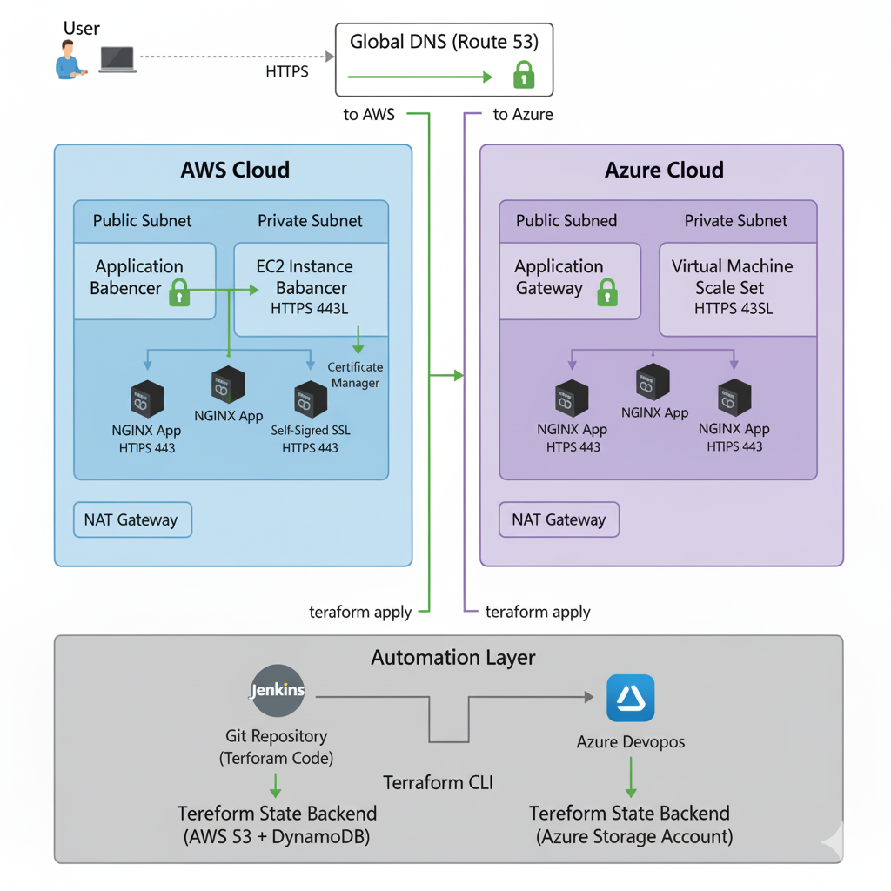

# 🌐 Scalable Website Deployment with Microservices using Infrastructure as Code

This project demonstrates the **deployment of a scalable microservices-based website** using **Terraform**, **Docker**, and **Azure Infrastructure**. It leverages **Infrastructure as Code (IaC)** principles for automation, modularity, and compliance, ensuring secure and repeatable deployments across environments.

---

## 🚀 Overview

The solution automates the provisioning and deployment of a **highly available web infrastructure** with:
- **Terraform** for infrastructure provisioning (networking, load balancing, compute)
- **Docker** for containerized application deployment
- **Azure DNS** for domain management and name resolution
- **Application Gateway (AGW)** for SSL termination and traffic distribution

---

## 🏗️ Architecture Overview


## inspired from:
  


- **Application Gateway (AGW):** Provides SSL offloading and load balancing.
- **Virtual Machine Scale Set (VMSS):** Hosts containerized web applications in a private subnet.
- **Azure DNS Zone:** Manages DNS records for the deployed website.
- **Docker Containers:** Run NGINX or a custom web application image.

---

## 🧱 Terraform Configuration

Terraform is used to automate Azure resource provisioning with a **modular and environment-based structure**.

### 📂 Directory Structure

```bash
├── backend.sh
├── env
│   ├── dev
│   │   ├── backend.tf
│   │   └── terraform.tfvars
│   └── prod
│       ├── backend.tf
│       └── terraform.tfvars
├── main.tf
├── modules
│   ├── appgw
│   │   ├── main.tf
│   │   ├── ouput.tf
│   │   └── variables.tf
│   ├── compute
│   │   ├── main.tf
│   │   ├── ouput.tf
│   │   └── variables.tf
│   ├── networking
│   │   ├── main.tf
│   │   ├── ouput.tf
│   │   └── variables.tf
│   └── nginx_app
│       ├── cloud_init.tpl
│       ├── Dockerfile
│       ├── main.tf
│       └── variables.tf
├── providers.tf
├── README.md
└── variables.tf
```

### 🧩 Key Features
- **Modular Design:** Enables reusability and better management across environments.
- **Remote Backend:** Stores Terraform state securely (e.g., Azure Storage Account).
- **Environment-Specific Configuration:** Each environment (`dev`, `prod`) has its own variables and backend setup.
- **Networking Design:** 
  - Private subnet for VMSS
  - Public subnet for Application Gateway
- **Compliance and Security:** Ensures separation of environments and secure state management.

### 🏃‍♂️ How to Use
```bash
# Initialize Terraform with backend
terraform init 

terraform init -backend-config=env/dev/backend.tf

# Plan the deployment
terraform plan -var-file=env/dev/terraform.tfvars

# Apply the configuration
terraform apply -var-file=env/dev/terraform.tfvars
```

# 🐳 Docker Configuration

Docker is used to containerize and serve the website or application.

## ✨ Features

Nginx Base Image: Can be replaced with any custom image for your service.

Port Binding: Maps host ports to container ports for accessibility.

Volume Mounting: Enables persistence and local file serving.

## ⚙️ Example Commands
```bash
# Build the Docker image
docker build -t my-nginx-app .

# Run the container
docker run -d -p 80:80 my-nginx-app

# Use Docker Compose
docker-compose up -d
🌍 DNS Configuration (Azure DNS)
🧠 What is DNS?
```
# DNS (Domain Name System) translates domain names (like example.com) into IP addresses for routing traffic.

# 🧾 Azure DNS Setup

## Create a DNS Zone in Azure.

Update your domain registrar to use Azure name servers.

Configure:

A Record: Points to Application Gateway’s public IP.

CNAME Record: Maps subdomains to your main domain.

Example:

|Record |Type	|Name	|Value	|Purpose|
|:--:|:--:|:--:|:--:|:--:|
|A	|@	|<\AGW Public IP>	|Root |domain mapping|
|CNAME	|www	|<\yourdomain>.azure.com	|Subdomain |alias|

# 📘 Best Practices

Keep environment variables and secrets secure using remote state encryption or Azure Key Vault.

Regularly validate Terraform configurations with terraform validate.

Use CI/CD pipelines (e.g., GitHub Actions, Azure DevOps) for automated deployments.

Implement SSL certificates for secure traffic via Application Gateway.

# 🧑‍💻 Prerequisites

- Terraform
- Docker
- Azure CLI configured with your subscription
- Domain name (for DNS configuration)

📦 Future Enhancements

- Add CI/CD pipeline with GitHub Actions or Azure DevOps.
- Integrate monitoring via Azure Monitor.
- Implement automatic scaling policies for VMSS.

👥 CREATOR

ASHSIH RAI

Contributions and suggestions are welcome via pull requests!